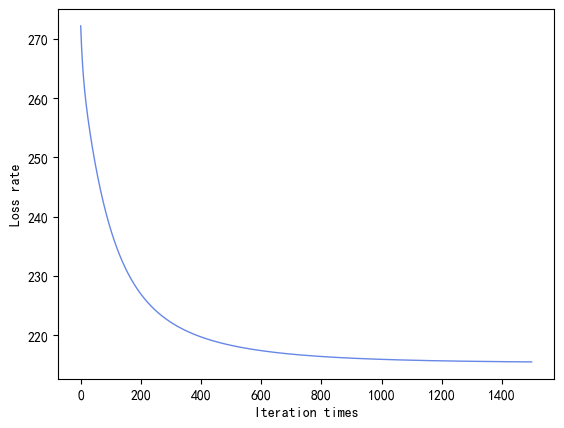
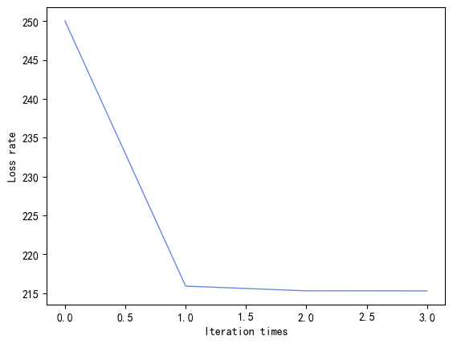

## Lab1 实验报告

**PB20111699 吴骏东**

**2022.10.8**

### 模型说明

目标函数为
$$
l(w)=\sum_{i=1}^m(-y_i\hat{w}\hat{x_i}+\log{(1+e^{\hat{w}^T\hat{x_i}}})) + \gamma_1||w||_1+\gamma_2||w||_2^2
$$
其中 $\gamma_1,\ \gamma_2$ 为 L1、L2 正则化的参数。二者至少有一个为 0。于是有
$$
\nabla l(\hat{w})=X^T\left(\frac{1}{1+e^{X\hat{w}}}-y\right)+\gamma_1\text{sign}(\hat{w})+2\gamma_2\hat{w}\\
\nabla^2l(\hat{w})=X^T\text{diag}(p_1(1-p_1))X+2\gamma_2I_n
$$

### 参数调整

#### 对于空缺数据的处理方式

|     处理方式     | 准确度  |
| :--------------: | :-----: |
|  直接删除对应行  | 0.79861 |
| 按照比例随机填充 | 0.79674 |

二者差距不大。为提高随机性，以下对照均采取按照比例随机填充的方式进行。

#### 牛顿迭代法与梯度下降法

|    方法    | 准确度  |
| :--------: | :-----: |
| 牛顿迭代法 | 0.78783 |
| 梯度下降法 | 0.78621 |

二者差距不大，但牛顿法的收敛速度显著大于梯度下降法。以下对照均采取梯度下降法进行。

#### 划分比例 $\alpha$

不删除额外特征，取 $lr = 0.005,\quad tol=1e^{-7}$

| $\alpha$ | 准确度  | $\alpha$ | 准确度  |
| :------: | :-----: | :------: | :-----: |
|   0.6    | 0.80081 |   0.72   | 0.79069 |
|   0.62   | 0.79914 |   0.74   | 0.79375 |
|   0.64   | 0.79729 |   0.76   | 0.79729 |
|   0.66   | 0.80382 |   0.78   | 0.80882 |
|   0.68   | 0.80203 |   0.8    | 0.81300 |
|   0.7    | 0.79459 |          |         |

#### 删除某些特征

取 $\alpha = 0.7,\quad lr = 0.005,\quad tol=1e^{-7}$

|     删除的特征      | 准确度  |                    删除的特征                    | 准确度  |
| :-----------------: | :-----: | :----------------------------------------------: | :-----: |
|         无          | 0.78571 |             'Gender' & 'LoanAmount'              | 0.81818 |
|      'Gender'       | 0.80519 |               'Gender' & 'Married'               | 0.81168 |
|      'Married'      | 0.80237 |              'Gender' & 'Education'              | 0.79870 |
|    'Dependents'     | 0.79220 |             'Married' & 'Education'              | 0.79764 |
|     'Education'     | 0.80519 |             'Married' & 'LoanAmount'             | 0.81271 |
|   'Self_Employed'   | 0.79870 |            'Education' & 'LoanAmount'            | 0.82467 |
|  'ApplicantIncome'  | 0.77922 |      'Gender' & 'Education' & 'LoanAmount'       | 0.83116 |
| 'CoapplicantIncome' | 0.77272 |       'Gender' & 'Married' & 'LoanAmount'        | 0.82231 |
|    'LoanAmount'     | 0.81168 | 'Gender' & 'Married'& 'Education' & 'LoanAmount' | 0.83766 |
| 'Loan_Amount_Term'  | 0.79859 |                                                  |         |
|  'Credit_History'   | 0.57142 |                                                  |         |
|   'Property_Area'   | 0.79220 |                                                  |         |

#### 对数回归曲线参数 lr

不删除额外特征，取 $\alpha=0.7,\quad tol=1e^{-7}$

|   lr    | 准确度  | 训练时间 |   lr    | 准确度  |  训练时间  |
| :-----: | :-----: | :------: | :-----: | :-----: | :--------: |
|  0.005  | 0.77837 |   0.2s   |  0.01   |   无    | $\gt$ 2min |
|  0.001  | 0.78379 |   0.4s   |  0.008  | 0.78378 |    0.6s    |
| 0.0005  | 0.78918 |   0.4s   |  0.007  | 0.77828 |    0.6s    |
| 0.0001  | 0.79459 |   1.6s   |  0.006  | 0.77840 |    0.7s    |
| 0.00005 | 0.78372 |   2.8s   | 0.00001 | 0.78918 |    6.9s    |

#### 梯度下降阈值 tol

不删除额外特征，取 $\alpha=0.7,\quad lr=0.005$

|    tol    | 准确度  |    tol     | 准确度  |
| :-------: | :-----: | :--------: | :-----: |
| $1e^{-4}$ | 0.78918 | $1e^{-10}$ | 0.77283 |
| $1e^{-3}$ | 0.80540 | $1e^{-9}$  | 0.77837 |
| $1e^{-2}$ | 0.81081 | $1e^{-8}$  | 0.77297 |
| $1e^{-1}$ | 0.82702 | $1e^{-7}$  | 0.77305 |
|  $1e^0$   | 0.83782 | $1e^{-6}$  | 0.78378 |
|  $1e^1$   | 0.75135 | $1e^{-5}$  | 0.77836 |

#### 对数回归曲线参数与梯度下降阈值的联合作用

不删除额外特征，取 $\alpha = 0.7$

|                 | lr = 0.005 | lr = 0.001 | lr = 0.0005 | lr = 0.0001 | lr = 0.00005 |
| :-------------: | :--------: | :--------: | :---------: | :---------: | :----------: |
| tol = $1e^{-5}$ |  0.77845   |  0.76216   |   0.76208   |   0.78381   |   0.77854    |
| tol = $1e^{-4}$ |  0.78918   |  0.77297   |   0.78875   |   0.79459   |   0.80541    |
| tol = $1e^{-3}$ |  0.80540   |  0.78832   |   0.81086   |   0.82702   |   0.81069    |
| tol = $1e^{-2}$ |  0.81081   |  0.82364   |   0.83129   |   0.83243   |   0.82699    |
| tol = $1e^{-1}$ |  0.82702   |  0.83342   |   0.83855   |   0.76220   |   0.67027    |

### 最终模型

采用梯度下降法，删除特征 'Gender' 、 'Married'、 'Education' 、 'LoanAmount'，取 $\alpha = 0.7,\quad lr=0.0005,\quad tol=1e^{-2},\quad \gamma=1$，采用梯度下降法得到模型的平均准确率为 0.83002。取随机数种子为 42675，得到最优模型准确率为 0.859，对应的损失曲线如下：

牛顿迭代法的曲线如下：

