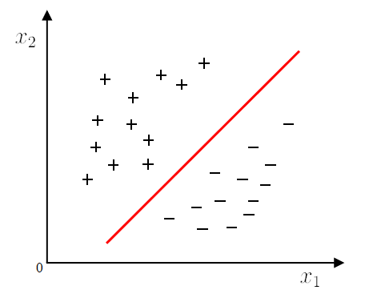
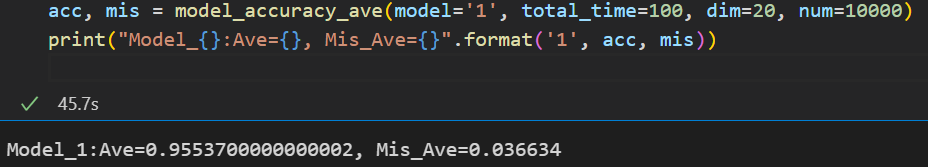

**机器学习概论实验报告**

**PB20111699 吴骏东**


## 原理分析

### 支持向量机

​		支持向量机（support vector machines, SVM）所解决的是二分类目标中确定最大间隔超平面的问题。



​		对于二分类样本集合 $D\in(R^n\times\{-1,1\})^m$ ，假设超平面能够将所有训练样本正确分类，即对于 $(x_i,\ y_i)\in D$，有 $y_i(w^Tx_i+b)>0$。我们定义超平面关于样本点 $(x_i,\ y_i)$ 的几何间隔为
$$
\gamma_i = y_i\left(\frac{w}{|w|}\cdot x_i+\frac{b}{|w|}\right)
$$
则支持向量机的优化问题为
$$
\max_{w,b}\gamma\\
\text{s.t. }\gamma_i \ge1, i=1,2,\cdots,m
$$
不失一般性，令 $w=\frac{w}{|w|\gamma},\ b=\frac{b}{|w|\gamma}$， 则上面的问题等价于
$$
\min_{w,b}\frac{1}{2}||w||^2\\
\text{s.t. }y_i(wx_i+b)\ge1,\ i = 1,2,\cdots,m
$$
这是一个含有不等式约束的凸二次规划问题。


### 软间隔 SVM

​		软间隔支持向量机是为了解决线性不可分问题而设计的，它允许支持向量机在一些样本上不满足约束条件（被错误分类）。之所以如此定义，是因为在样本集中总是存在一些噪音点或者离群点，如果强制要求所有的样本点都满足硬间隔，可能会导致出现过拟合的问题，甚至会使决策边界发生变化。

​		我们引入如下的优化目标：
$$
\underset{w,b}{\min}\frac{1}{2}||w||^2+\gamma\sum_{i=1}^{m}\ell_{0/1}(y_i(w^Tx_i+b)-1)
$$
其中 $\gamma$ 为正则化参数， $\ell_{0/1}$ 是 0/1 损失函数
$$
l_{0/1}(z) \begin{cases}1, \quad if \ z<0;\\ 0, \quad otherwise.\end{cases}
$$
由于 $\ell_{0/1}$ 非凸、不连续，我们采用 Hinge 损失函数进行替代
$$
\ell_{Hinge}(z)=max(0,1-z)
$$
于是得到了最终的优化目标
$$
\underset{w,b}{\min}\frac{1}{2}||w||^2+\gamma\sum_{i=1}^{m}\ell_{Hinge}(y_i(w^Tx_i+b)-1)
$$


### 基于梯度下降的软间隔 SVM 求解

​		引入 $\hat{w}=\begin{pmatrix}w\\b\end{pmatrix},\ \hat{X}=\begin{pmatrix}X&1\end{pmatrix},\ \xi_i=\max(0, 1-y_i\hat{w}^T\hat{x}_i)$。同时，我们记 
$$
\hat{y}=(\hat{y_i}),\ where\ \hat{y_i}=\left\{ \begin{matrix}0,\text{ if } \xi_i=0\\y_i,\text{ if }\xi_i \ne0\end{matrix}\right.
$$
于是目标问题可化为
$$
\begin{align}
L &= \frac{1}{2}w^Tw + \gamma\sum_{i=1}^m\xi_i\\
\Rightarrow\nabla L&=w-\gamma \hat{X}^T\hat{y} \\
w_{new}&=w_{old}-lr\times \nabla L
\end{align}
$$


核心代码如下

```python
m, n = X.shape
self.w = np.zeros((n + 1, 1))

temp_1 = np.ones((m, 1))
X_hat:np.ndarray = np.c_[X, temp_1]

temp_0 = np.zeros((m, 1))
loss_list = []
y_diag = np.diag(y.reshape(-1))

for times in range(max_times):
xi = array_max(temp_0, 1 - (y_diag @ X_hat @ self.w))
loss = 0.5 * (self.w.T @ self.w)[0][0] + gamma * (xi.sum())

y_bar = array_find0(xi , y)

delta_1 = self.w - gamma * (X_hat.T @ y_bar)

if times >= 2 and abs(loss_list[-1] - loss) < tol:
loss_list.append(loss)
break

self.w = self.w - lr * delta_1
loss_list.append(loss)
```


### 基于 SMO 的软间隔 SVM 对偶问题求解

​		SMO 算法的基本思想是：如果所有变量的解都满足最优化问题的 KKT 条件，则已经得到该最优化问题的解。否则，我们可以选择两个变量，同时固定其他变量，仅针对这两个变量构建一个二次规划问题。
​		这样，我们通过求解两个变量的二次规划问题，能让结果不断靠近原有凸二次规划问题的解，并且双变量二次规划问题有着对应的解析方法。

##### 启发式变量选择法

​		SMO 算法在每个子问题中需要选择两个变量进行优化，并且其中至少一个变量是违反 KKT 条件的。为此我们可以先找出违反 KKT 条件最为 “严重” 的一系列变量，按照一定顺序存入 `index_1_list`。随后，对于 `index_1_list` 中的每个变量 $\alpha_i$，遍历所有 $\alpha_j,\ j\ne i$ 使得 $|E_1-E_2|$ 达到最大。如果不存在这样的 $\alpha_j$ ，则顺延至下一个 $\alpha_i$。直到 $\Delta\ell<tol$ 或所有 $\alpha_i$ 均满足 KKT 条件为止。


##### 双变量二次规划问题求解

​		不妨假定 $\alpha_1,\ \alpha_2$ 为目标变量，其余变量保持固定。并设问题的原始可行解为 $\alpha_1^{old},\ \alpha_2^{old}$， 双变量二次规划问题的最优解为 $\alpha_1^{new},\ \alpha_2^{new}$，且沿着约束方向未裁剪的 $\alpha_2$ 最优解为 $\alpha_2^{uncut-new}$。由于约束条件 $\sum_{i=1}^m\alpha_iy_i = 0$ 以及 $0 \le \alpha_i\le \gamma$ 的存在，我们应有 $low\le\alpha_2^{uncut-new}\le high$。其中
$$
low=\left\{\begin{matrix}\max(0,\ \alpha_2^{old}-\alpha_1^{old}),\quad y_1=y_2\\\max(0,\ \alpha_1^{old}+\alpha_2^{old}-\gamma),\quad y_1\ne y_2\end{matrix}\right.\\
high=\left\{\begin{matrix}\min(\gamma,\ \gamma+\alpha_2^{old}-\alpha_1^{old}),\quad y_1=y_2\\\min(\gamma,\ \alpha_1^{old}+\alpha_2^{old}),\quad y_1\ne y_2\end{matrix}\right.
$$
可以证明，双变量二次规划问题沿着约束方向未经剪辑的解为
$$
\alpha_2^{uncut-new}=\alpha_2^{old}+\frac{y_2(E_1-E_2)}{\eta}
$$
其中 
$$
E_i=\sum_{i=1}^m\alpha_iy_ix_ix^T+b-y_i
$$
代表第 i 个样本的预测误差；而
$$
\eta=x_1x_1^T+x_2x_2^T-2x_1x_2^T=||x_1-x_2||^2
$$
为常数。

​		经过剪辑后的解为 
$$
\alpha_2^{new}=\left\{\begin{matrix}
H,\quad\alpha_2^{uncut-new}>H\\
\alpha_2^{uncut-new},\quad L\le\alpha_2^{uncut-new}\le H\\
L,\quad\alpha_2^{uncut-new}<L
\end{matrix}\right.
$$
再代回约束式可得
$$
\alpha_1^{new}=\alpha_1^{old}+y_1y_2(\alpha_2^{old}-\alpha_2^{new})
$$


## 模型评价

### 模型 1：基于梯度下降的软间隔 SVM 求解

​		由于该模型大部分的计算过程均为矩阵运算，所以计算效率会很高。我们采用大样本数据集进行验证。


#### 极端大样本单次验证

数据大小: $20000\times50$，错标率 0.06。训练时间: 2min35s； 模型准确率： 90.7%


#### 大样本单次验证

数据大小： $10000 \times 20$，错标率 0.036。训练时间: 2.1s； 模型准确率： 95.1%。参数：gamma = 0.005, lr = 0.002, tol=1e-4, max_times=100


#### 大样本平均验证

数据大小： $10000 \times 20$，重复次数： 100次。样本平均错标率为 0.036634，模型平均准确率为 0.9553700000000002，用时 45.7s。




### 模型 2：基于 SMO 的软间隔 SVM 对偶问题求解

​		由于该模型的计算大部分为函数调用与循环实现，所以运算速度相对较低。我们采用小样本数据集进行验证。此外， SMO 对参数敏感，**针对不同大小的数据需要更改相应的参数，否则准确率与耗时水平都会下降**。


#### 小样本单次验证

数据大小： $200 \times 10$，错标率 0.02。训练时间: 5.1s； 模型准确率： 95%。参数：gamma = 0.1, tol = 1e-3, max_times=800, epslion=0.2


#### 小样本平均验证

数据大小： $200 \times 10$，重复次数： 50次。样本平均错标率为 0.0372，模型平均准确率为 0.8926666666666664，用时 4min28s。


## 模型比较

​		**随机生成 50 组小样本**，对梯度下降、SMO、sklearn.svm 三个模型进行准确率、计算时间的综合比较，结果如下

|   样本大小    | 错标率  | 梯度下降准确率 | 梯度下降用时 | SMO 准确率 | SMO 用时 | sklearn 准确率 | sklearn 用时 |
| :-----------: | :-----: | :------------: | :----------: | :--------: | :------: | :------------: | :----------: |
|  $50\times5$  | 0.04680 |    0.90667     |   0.00093    |  0.89733   |  0.0725  |    0.90133     |     0.0      |
| $100\times10$ | 0.04020 |    0.89533     |   0.00107    |  0.88067   | 0.62594  |    0.89333     |   0.00125    |
| $200\times10$ | 0.03275 |    0.90667     |   0.00090    |  0.89667   |  2.065   |    0.92917     |   0.00547    |

