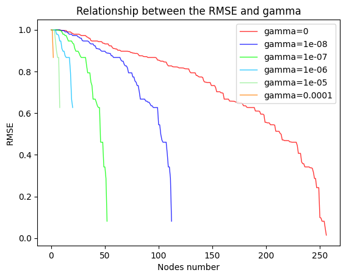
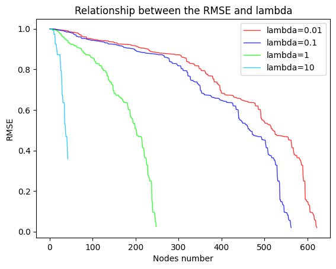
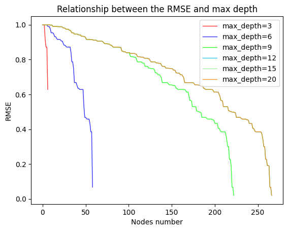
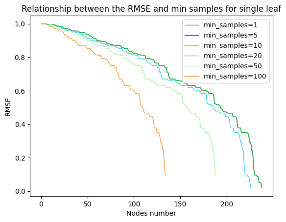
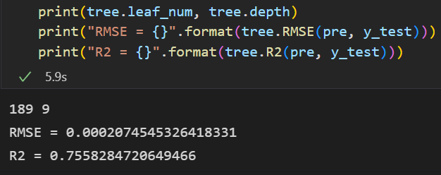
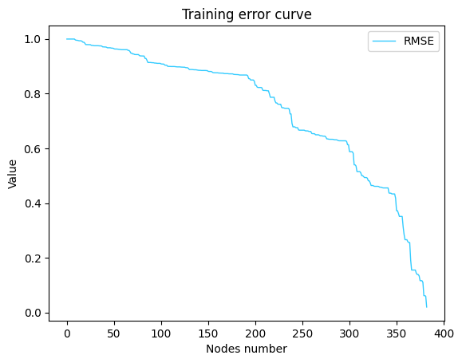
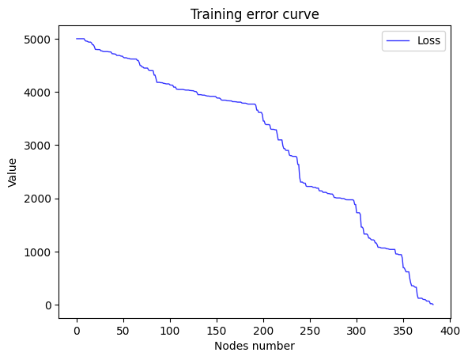

# 机器学习概论实验报告

**PB20111699 吴骏东**

**2022.11.20**

​		在本次的实验中，我们需要自主实现基于回归树的 XGBoost 模型。本文将从算法原理、代码实现、结果分析等方面展开。如果对于其中部分内容有疑问或者有其他改进意见，欢迎提出 issue 或直接联系作者。


## 原理分析

### XGBoost

XGBoost 是由多个基模型组成的一个加法模型，假设第 $k$ 个基本模型是 $f_k (x)$, 那么前 $t$ 个模型组成的模型的输出为
$$
y ̂_i^{(t)}=∑^t_{k=1}f_k (x_i )=y ̂_i^{(t-1)}+f_t (x_i )
$$
其中 $x_i$ 为第表示第 $i$ 个训练样本，$y_i$ 表示第 $i$ 个样本的真实标签;  $y ̂_i^{(t)}$ 表示前 $t$ 个模型对第 $i$ 个样本的标签最终预测值。

在学习第 $t$ 个基模型时，XGBoost 要优化的目标函数为:
$$
\begin{split}
Obj^{(t)} &= \sum_{i=1}^n loss(y_i,\hat y_i^{(t)})+\sum_{k=1}^t penalty(f_k)\\
&=\sum_{i=1}^n loss(y_i,\hat y_i^{(t-1)}+f_t(x_i))+\sum_{k=1}^t penalty(f_k)\\
&=\sum_{i=1}^n loss(y_i,\hat y_i^{(t-1)}+f_t(x_i))+ penalty(f_t)+constant\\
\end{split}
$$
其中 $n$ 表示训练样本的数量, $penalty(f_k)$ 表示对第 $k$ 个模型的复杂度的惩罚项,  $loss(y_i,\hat y_i^{(t)})$ 表示损失函数,

例如二分类问题的 
$$
𝑙𝑜𝑠𝑠(𝑦_𝑖,𝑦 ̂_𝑖^{(𝑡)} )=−𝑦_𝑖\cdot \log⁡ p(𝑦 ̂_𝑖^{(t)}=1|𝑥_𝑖)−(1−𝑦_𝑖)\log⁡ (1-p(y ̂_𝑖^{(t)}=1|𝑥_𝑖))
$$
回归问题
$$
𝑙𝑜𝑠𝑠(𝑦_𝑖,\hat{y}^{(t)}_i )=(𝑦_𝑖−\hat{y}^{(t)}_i )^2
$$
将 $loss(y_i,\hat{y}^{(t-1)}_i+f_t (x_i))$ 在 $y ̂_i^{(t-1)}$ 处泰勒展开可得
$$
loss(y_i,y ̂_i^{(t-1) }+f_t (x_i))≈loss(y_i,y ̂_i^{(t-1)} )+g_i f_t (x_i )+\frac12 h_i f_t^2 (x_i)
$$
其中 $g_i=\frac{\partial\ loss(y_i,y ̂_i^{(t-1)})}{\partial\  y ̂_i^{(t-1) } }$, $h_i=\frac{\partial^2 loss(y_i,y ̂_i^{(t-1)} )}{\partial \ (y ̂_i^{(t-1)} )^2 }\\ $，即 $g_i$ 为一阶导数，$h_i$ 为二阶导数。

此时的优化目标变为
$$
Obj^{(t)}=∑_{i=1}^n[loss(y_i,y ̂_i^{(t-1)} )+g_i f_t (x_i )+\frac12 h_i f_t^2 (x_i)]+penalty(f_t ) +constant
$$
去掉常数项 $loss(y_i,y ̂_i^{(t-1) })$ (学习第 $t$ 个模型时候， $loss(y_i,y ̂_i^{(t-1) })$ 也是一个固定值) 和 constant，可得目标函数为
$$
Obj^{(t)}=∑_{i=1}^n[g_i f_t (x_i )+\frac12 h_i f_t^2 (x_i)]+penalty(f_t )
$$


### 决策树（回归树）

​		本实验中，我们以决策树（回归树）为基。假设决策树有 $T$ 个叶子节点，每个叶子节点对应有一个权重。决策树模型就是将输入 $x_i$ 映射到某个叶子节点，决策树模型的输出就是这个叶子节点的权重，即 $f(x_i )=w_q(x_i )$ ，$w$ 是一个要学的 $T$ 维的向量。其中 $q(x_i)$ 表示把输入 $x_i$ 映射到的叶子节点的索引，例如：$q(x_i )=3$，那么模型输出第三个叶子节点的权重，即 $f(x_i )=w_3$。

​		对于某一棵决策树，我们定义他的惩罚为
$$
penalty(f)=\gamma\cdot T+\frac12\lambda\cdot\|w\|^2
$$
其中 $\gamma,\lambda$ 为可调整的超参数，$T$ 为叶子结点数，$w$ 为权重向量. 由于显示问题，$\|w\|$ 实际上为 $w$ 的范数，且 $\|w\|^2=\sum_{i=1}^{dim}w_i^2$。

​		我们将分配到第 $j$ 个叶子节点的样本用 $I_j$ 表示，即 $I_j=\{i|q(x_i )=j\} (1≤j≤T)$。则在树结构确定时，可以进行如下优化：
$$
\begin{split}
𝑂𝑏𝑗^{(𝑡)}&=∑_{𝑖=1}^𝑛[𝑔_𝑖 𝑓_𝑡 (𝑥_𝑖 )+\frac12 ℎ_𝑖 𝑓_𝑡^2 (𝑥_𝑖)]+𝑝𝑒𝑛𝑎𝑙𝑡𝑦(𝑓_𝑡 )\\
&= ∑_{i=1}^n[g_iw_{q(𝑥_𝑖 )} +\frac12  ℎ_𝑖 𝑤_{𝑞(𝑥_𝑖 )}^2]+𝛾⋅𝑇+\frac12 𝜆⋅\|𝑤\|^2\\
&=∑_{𝑗=1}^𝑇[(∑_{i∈𝐼_𝑗}𝑔_𝑖 )⋅𝑤_𝑗+\frac12⋅(∑_{𝑖∈𝐼_𝑗}ℎ_𝑖+𝜆)⋅𝑤_𝑗^2 ]+𝛾⋅𝑇
\end{split}
$$
简单起见，我们简记 $G_j=∑_{i∈𝐼_𝑗}𝑔_𝑖 , H_j=∑_{i∈𝐼_𝑗}h_𝑖 $
$$
Obj^{(t)}=\sum_{j=1}^T[G_jw_j+\frac12(H_j+\lambda)w_j^2]+\gamma T
$$

令上式关于 $w_j$ 的梯度为 0，我们可得
$$
\frac{\partial Obj^{(t)}}{\partial w_j}=G_j+(H_j+\lambda)w_j=0\\
\Rightarrow w_j=-\frac{G_j}{H_j+\lambda}
$$
这就是最优情况下的 $w_j$。对应最优 $Obj^{(t)}$ （当前模型的得分）为
$$
Obj^{(t)}=\sum_{j=1}^T-\frac{G_j^2}{2(H_j+\lambda)}+\gamma T
$$


​		对于回归树模型，我们有
$$
𝑙𝑜𝑠𝑠(𝑦_𝑖,\hat{y}^{(t)} )=(\hat{y}^{(t)})^2
$$
所以
$$
g_i = 2(y_i-\hat{y}^{(t)}_i)\\
h_i=2
$$
故
$$
G_j=∑_{i∈𝐼_𝑗}2(y_i-\hat{y}^{(t)}_i) \\
H_j=2|I_j|
$$


## 代码设计与分析

### 回归树

#### 基本数据结构

​		对于一棵回归树，我们可以采用二叉树的基本结构，再加上一些额外的信息作为数据结构。例如结点编号、结点的预测值（叶子结点专属）、结点对应的样本集合、结点的特征分类标准等。

```python
class Node:
    def __init__(self, index:list, id = -1, feature = -1, f_val = -1.) -> None:
        self.l = -1
        self.r = -1
        self.id = id
        self.w = -1

        self.index = index
        self.feature = feature
        self.f_val = f_val
```

考虑到 python 的语言特性，我们无需采用指针或额外的数据结构来进行空结点的判断，直接赋值为 -1 即可。


#### 输出预测

​		回归树的预测可以看作是对于二叉树的查找操作。从根节点开始，根据每个结点的分类标准选择进入左右孩子，直到来到叶子结点，并将叶子结点的 w 值作为预测值输出。

```python
def _predict(self, x): 
    # Predict a sample
    node = self.root
    while node.l != -1 or node.r != -1:
        if x[node.feature] <= node.f_val:       
            node = node.l
        else:
            node = node.r
    return node.w
```


#### 参数传递

​		考虑到如果直接传递原始数据集或其子集，我们会消耗十分巨大的空间资源。但对于每个结点，我们必须要记录当前节点所分配到的样本编号。为了解决这一问题，我们引入了下标传递策略。考虑如下语法

```python
arr = np.array([5,4,3,2,1])
index = [3,1,0]
print(arr[index])
>>> [2, 4, 5]
```

​		这样，我们就只需要在每个结点维护当前的 index 列表即可，节省了空间，同时又实现了既定的目标。


#### 确定最优划分

​		对于每一棵决策树，即每一个基的训练，我们可以按照以下步骤划分结点

1. 从根节点开始递归划分，初始情况下，所有的训练样本 $x_i$ 都分配给根节点。

2. 根据划分前后的收益划分结点，收益为
   $$
   Gain = Obj_P-Obj_L-Obj_R
   $$
   其中 $Obj_P$ 为父结点的得分，$Obj_L,Obj_R$ 为左右孩子的得分.

3. 选择最大增益进行划分

选择最大增益的过程如下：

1. 选出所有可以用来划分的特征集合 $\mathcal F$；
2. For feature in $\mathcal F$:
3. 将节点分配到的样本的特征 feature 提取出来并升序排列，记作 sorted_f_value_list；
4. For f_value in sorted_f_value_list ：
5. 在特征 feature 上按照 f_value 为临界点将样本划分为左右两个集合；
6. 计算划分后的增益；
7. 返回最大的增益所对应的 feature 和 f_value。 

上面是算法的流程图。本实验的代码实现如下

```python
for col in range(self.n):
    _feature = self.X[node.index, col:col+1].copy().reshape(1, -1)[0]

    feature = list(set(_feature))	# 消除相同值
    feature.sort()

    for f_value in feature:
        _index1 = np.where((self.X[node.index, col:col+1] <= f_value).all(axis=1))[0]
        index1 = np.array(node.index)[_index1]
        _index2 = np.where((self.X[node.index, col:col+1] > f_value).all(axis=1))[0]
        index2 = np.array(node.index)[_index2]
        
        gain = self._get_score(node.index, self.leaf_num) \
             - self._get_score(index1, self.leaf_num + 1) \
             - self._get_score(index2, self.leaf_num + 1)

        if gain > max_gain:
            # 更新当前记录的最优划分信息
            max_gain = gain
            max_feature = col
            max_f_value = f_value
            max_index1 = index1
            max_index2 = index2

      
return max_feature, max_f_value, max_gain, max_index1, max_index2
```

​		注意到我们采用了下标作为样本集合的传递参数。这样，我们就需要得到划分之后的下标集合，也就是原始数据集中**某一列小于特定值的行的下标**集合。思路也很直接：对于每一个样本单独进行检测即可。但 numpy 提供了一个高效的函数实现 `np.where()` [参考：np.where() 的使用方法](https://blog.csdn.net/island1995/article/details/90200151)。

```python
_index = np.where((self.X[node.index, col:col+1] <= f_value).all(axis=1))[0]
index = np.array(node.index)[_index]
```

​		第一行确定了下标在 node.index 中的行（**当前结点所包含的样本**）的 col 列中所有下标（**当前结点包含的样本在当前特征的取值**）小于当前划分标准的行的下标（样本编号）。由于这里是在子集中进行的计算，我们需要将下标再映射回到结点包含样本的下标上，这也就是第二行的作用。


#### 回归树的构建

​		构建一棵回归树，我们可以采用递归的策略（深度优先），即优先对左子树进行划分，直到左子树称为叶子结点为止。

```python
def _fit(self, node:Node, depth = 1)->int:
      
    feature, f_value, gain, index1, index2 = self._get_best_split(node)
    # 获得当前结点的最优划分信息
    _feature = self.X[node.index, feature:feature+1].copy().reshape(1, -1)[0]
    f = list(set(_feature))

    if < 特定的划分停止条件 >:
        # This is a leaf
        # Do something else
        pass

    
    node.feature = feature
    node.f_val = f_value
    # 设定当前结点的划分信息
    node.l = Node(index1, id=self.node_num)
    node.r = Node(index2, id=self.node_num + 1)
    self.node_num += 2

    self._fit(node.l, depth+1)
    self._fit(node.r, depth+1)
```

​		自然，使用广度优先也是可行的，只需要使用一个队列维护待处理的结点即可。


#### ★划分停止的策略

​		现在，我们将讨论回归树模型中最重要的问题：如何决定停止划分，将当前结点标记为叶子节点，因为无休止的划分将会导致灾难性的过拟合。一个很自然的想法是，我们限制回归树的深度即可。本实验引入了如下的终止策略

- 树的最大深度：一棵树自然不能太深，为此我们限制回归树的深度，当当前结点深度达到设定阈值时，就将其标记为叶子结点；
- 结点的最少样本数：仅有一个样本的结点自然可以称为叶子结点。但我们也可以人为设定这一阈值，使得少于特定数量的样本即会被视作一个单独的叶子结点而不进行划分；
- 结点的最少不同特征数：样本的特征均为连续值，这样划分到最后总是得到单一特征取值的叶子结点。我们也可以人为将其离散化，当该划分特征的可能取值数目小于一定阈值时，就不再进行划分；
- 结点的最小增益：当划分前后节点得分增益不足时，我们就不再进行划分。自然，结点的最小增益应当至少为 0，否则回归树将被负优化。


### XGBoost

​		相比较回归树，XGBoost 仅仅是一个框架，所以实现起来就简单了很多。

```python
def fit(self, T, min_train_err,tree_parameters):
    m, n = self.y.shape
    self.T = T
    y_t = np.zeros((m, 1))
	# 初始模型输出设为 0
    for _ in range(0, self.T):
        tree = RegTree(self.X, self.y, y_t)
        tree.fit(tree_parameters)

        y_t = y_t + tree.predict(self.X)
        self.treeset.append(tree)
        
        err = tree._get_err(y_t)
        # 计算是否产生过拟合
        if err < min_train_err:
            break
```

对于每一轮的迭代，我们只需要用上一轮的结果重新训练基学习器，并将结果进行叠加即可。

#### ★迭代停止的策略

​		上层模型提供的迭代停止策略包括：

- 基学习器的数目：在学习 T 个基学习器的输出后就停止。这是为了防止欠拟合；
- 验证集均方误差：在验证集上的均方误差小于某个阈值时停下来。这是为了防止过拟合。


## 模型训练与比较

### 评价指标

​		本实验中采用的指标包括：

- $RMSE=\sqrt{\frac1m\sum_{i=1}^m(y_{test}^{(i)}-\hat y_{test}^{(i)})^2}\\ $，越小越好，

- $R^2=1-\frac{ \sum_{i=1}^m(y_{test}^{(i)}-\hat y_{test}^{(i)})^2}{\sum_{i=1}^m(\bar y_{test}-\hat y_{test}^{(i)})^2}=1-\frac{MSE(\hat y_{test},y_{test})}{Var(y_{test})}\\ $，越大越好


```python
def RMSE(self, pre:np.ndarray, val:np.ndarray):
    y = val - pre
    m, _ = y.shape
    return np.sqrt((y.T @ y) / m)[0][0]

def R2(self, pre:np.ndarray, val:np.ndarray):
    var = np.var(val)
    return(1 - (self.RMSE(pre, val) ** 2)/ var)
```


### 单一回归树

默认参数集合为

```python
parameters = {
    "lamda": 1,            
    "gamma": 0,            
    "gain_delta": 0,       
    "max_depth": 10,
    "max_leaves": 100,
    "max_nodes": 1000,
    "min_samples": 3,      
    "min_feature_dif": 3, 
    "if_silent": 1,
}
```

#### 超参数 $\gamma$



#### 超参数 $\lambda$



#### 树的最大深度



​		当深度超过 12 时曲线不再变化，表明已经出现了过拟合。

#### 叶子结点样本数



#### 最终模型

​		选取参数为

```python
parameters = {
    "lamda": 0.1,            
    "gamma": 0,            
    "gain_delta": 0,       
    "max_depth": 9,
    "max_leaves": 100,
    "max_nodes": 1000,
    "min_samples": 5,      
    "min_feature_dif": 3, 
    "if_silent": 1,
}
```

得到的单回归树指标为：RMSE = 0.0002，R2 = 0.7558。







RMSE 与 均方误差的训练曲线基本一致。


### XGBoost 模型

默认参数：T = 30，min_err = 1e-5，

```python
parameters = {
    "lamda": 0.1,            
    "gamma": 0,            
    "gain_delta": 0,       
    "max_depth": 3,
    "max_leaves": 100,
    "max_nodes": 1000,
    "min_samples": 3,      
    "min_feature_dif": 3, 
    "if_silent": 1,
}
```

#### 回归树数目

| 基学习器数目 |          RMSE           |   R2    |
| :----------: | :---------------------: | :-----: |
|      5       | $2.24495 \times10^{-4}$ | 0.71653 |
|      15      | $2.03415 \times10^{-4}$ | 0.76727 |
|      30      | $1.96534 \times10^{-4}$ | 0.78275 |
|      50      | $1.80369 \times10^{-4}$ | 0.79752 |


#### 样本均方误差

| 最小样本均方误差 |          RMSE           |   R2    |
| :--------------: | :---------------------: | :-----: |
|       1e-2       | $2.80434 \times10^{-4}$ | 0.52902 |
|       1e-4       | $1.90967 \times10^{-4}$ | 0.78159 |
|       1e-6       | $1.90967 \times10^{-4}$ | 0.78159 |
|       1e-8       | $1.90967 \times10^{-4}$ | 0.78159 |


#### 最终模型

T = 35， min_err = 1e-4。


其中，纵坐标为训练集均方误差。R2 达到了 0.8+，与 Sklearn 所提供的库效果相当。

​		

### 总结

​		可以看到，采用 XGBoost 可以在仅训练 3 层的回归树基础上得到回归效果较好的预测模型。这就是集成学习的力量！