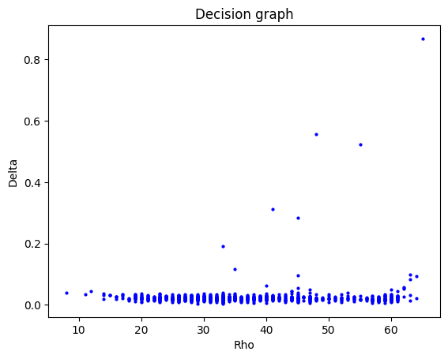
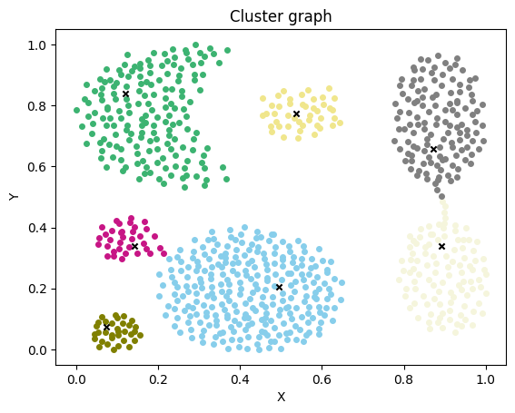
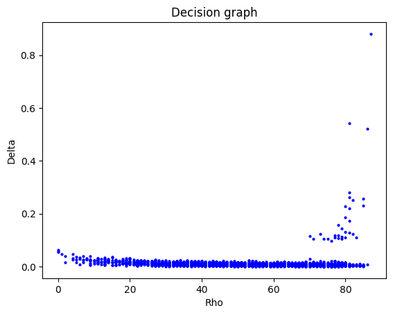
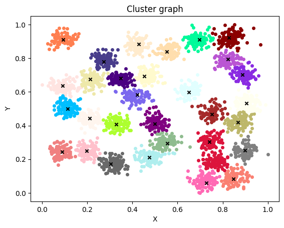
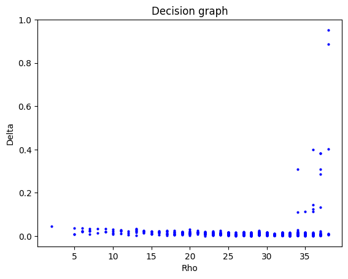
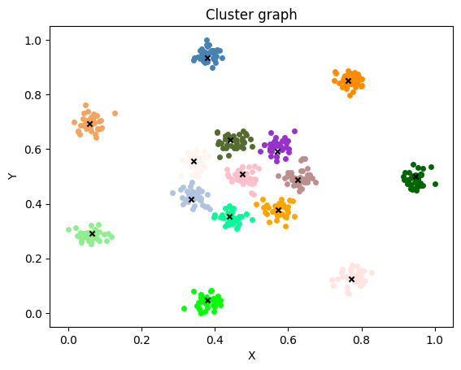

# 机器学习概论实验报告

**PB20111699 吴骏东**

**2022.12.8**

​		在本次的实验中，我们需要自主实现 [《Clustering by fast search and find of density peaks》](https://sites.psu.edu/mcnl/files/2017/03/9-2dhti48.pdf) 一文中提到的聚类算法（以下简称 DPC 算法）


## 原理分析

### DPC

​		DPC 算法是集成了 k-means 和 DBSCAN 两种算法的聚类算法。算法指出，在聚类过程中，聚类中心往往满足以下两个特征：

- 聚类中心周围密度较低，中心密度较高；
- 聚类中心与其它密度更高的点之间通常都距离较远。

基于此，我们可以采用如下的策略选择聚类中心：

1. 引入参数 $d_c$

2. 对于每一个数据点 $m_i$，计算下面的两个指标：

   局部密度：$\rho_i=\sum_j\chi(d_{ij}-d_c)$，其中 $\chi(x)=1\text{ if }x<0 \text{ and } \chi(x)=0\text{ if } x\ge0$；

   密度距离：$\delta_i=\min_{\rho_j>\rho_i}d_{ij}$。若当前数据点 $m_i$ 为 $\rho$ 最大点，则定义 $\delta_i=\max_{j\ne i} d_{ij}$。

3. 绘制 $\delta-\rho$ 决策图。样本点因如下特征而被划分成不同类型的点：

   聚类中心：$\delta$ 较大且 $\rho$ 加大；

   离群点：$\delta$ 较大而 $\rho$ 较小；

   普通点：其他所有非聚类中心与离群点。

4. 根据决策图，确定聚类中心的划分指标。对于每一个普通点 $m_i$，将其划分到 $m_j$ 所在的聚类簇中，其中 $j=\text{argmin}_{\rho_j>\rho_i}d_{ij}$。

   综上所述，我们可以实现简单而高效的聚类算法。


## 代码设计与分析

### 数据预处理

​		由于原始数据之间的距离差异较大，为了便于绘图与计算，我们将数据进行归一化。

```python
import pandas as pd
import numpy as np

df = pd.read_csv(FILEPATH, names=['x','y'], header=None,sep=" ")
data = df.apply(lambda x: (x - np.min(x)) / (np.max(x) -np.min(x)).round(4).to_numpy()
```


### DPC 算法

#### 计算顶点距离

​		为了高效计算数据点之间的距离，我们采用矩阵运算的形式。假设原始数据集 $X\in\mathbb{R}^{m\times2}$，
$$
\begin{align}
d_{ij}&=\sqrt{(x_i-x_j)^2+(y_i-y_j)^2}\\
&=\sqrt{(x_i^2+y_i^2)+(x_j^2+y_j^2)-2(x_ix_j+y_iy_j)}
\end{align}
$$
定义 $D^2=(d_{ij}^2)_{m\times m}$， $X^2=(x_{ij}^2)_{m\times2}$，于是有
$$
D^2=X^2\begin{pmatrix}1&\cdots&1\\1&\cdots&1\end{pmatrix}+\begin{pmatrix}1&1\\\vdots&\vdots\\1&1\end{pmatrix}{X^2}^T-2XX^T
$$
在代码中，我们如下进行距离矩阵的初始化

```python
self.X = data
self.m, self.n = self.X.shape
X2 = np.square(self.X)
one = np.ones((self.m, self.n))
self.D = np.sqrt(np.abs(X2 @ one.T + one @ X2.T - 2 * self.X @ self.X.T))
```


#### 计算 $\rho$ 与 $\delta$

```python
def calculate(self, dc = 1):
    self.rho = np.zeros((self.m, 1))
    self._rho = np.zeros((self.m, 1))
    self.delta = np.zeros((self.m, 1))

    for i in range(0, self.m):
        index = np.where((self.D[i:i+1][:] < dc).all(axis=0))[0]
        self.rho[i] = len(index) - 1
        self._rho[i] = self.rho[i] + np.random.rand()/1000

    max_rho = self._rho.max()

    for i in range(0, self.m):
        if self._rho[i] == max_rho:
        	self.delta[i] = np.max(self.D[i][:])
        else:
        	index = np.where(self._rho > self._rho[i][0])[0]
        	self.delta[i] = np.min(self.D[i][index])
```


#### 确定聚类中心

​		根据决策图，确定属于决策中心的点的参数范围 $\rho_{min}$、$\delta_{min}$。随后将 $\rho\ge\rho_{min},\delta\ge\delta_{min}$ 的数据点标记为聚类中心点。

```python
def find_center(self, base_rho, base_delta):
    rho_index = np.where(self._rho >= base_rho)[0]
    delta_index = np.where(self.delta[rho_index, :] >= base_delta)[0]
    self.center_index = np.array(rho_index)[delta_index]
    self.cluster_num = len(self.center_index)

    all = list(range(0, self.m))
    self.other_index = []
    for i in all:
        if i not in self.center_index:
            self.other_index.append(i)
```


#### 聚类簇划分

​		在确定聚类中心点的坐标后，我们按照 $\rho$ 递减的顺序，对普通点进行聚类划分：将其划分到比自己 $\rho$ 更大的最近的点所属的簇中。为了便于绘图，对于每一个簇，我们维护一个下标集合，用来标记被分在该簇中的顶点；每一个顶点都有一个标签，用于标记其所在的簇。

```python
def _get_cluster(self):
    self.clusters = []
    self.label = np.zeros((self.m, 1))

    for i in range(0, self.cluster_num):
        self.clusters.append([])

    for i in range(0, self.cluster_num):
        self.label[self.center_index[i]] = int(i) 

    self.other_index.sort(key=self._get_rho, reverse=True)

    for i in self.other_index:
          index = np.where(self._rho > self._rho[i][0])[0]
          i_index = index[np.argmin(self.D[i][index])]
          cluster_index = int(self.label[i_index][0])

          self.clusters[cluster_index].append(i)
          self.label[i] = cluster_index
```


## 模型训练与比较

### 评价指标

​		本次实验采用 DBI 作为评价指标。


```python
import sklearn.metrics as sklm
score = sklm.davies_bouldin_score(data, model.label.flatten())
print("DBI = {}".format(score))
```


### Aggregation

​		参数设定为 $d_c=0.1, \rho_{min}=20, \delta_{min}=0.11$





DBI = 0.5461317734754553


### D31

​		参数设定为 $d_c=0.01, \rho_{min}=60, \delta_{min}=0.1$






DBI = 0.5657232907049606


### R15

​		参数设定为 $d_c=0.05, \rho_{min}=30, \delta_{min}=0.08$





DBI = 0.3147059939103035


### 总结

​		本次实验通过实现 DPC 算法，我对于聚类有了更深的认识。