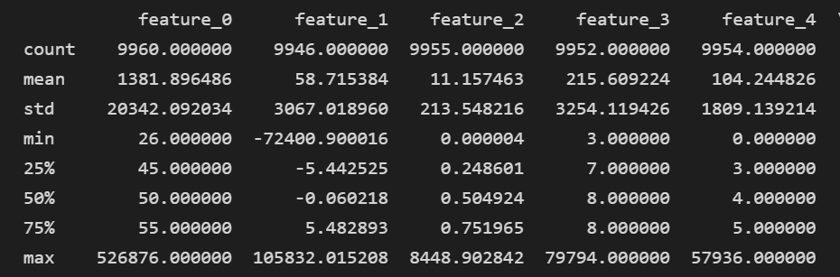

# 机器学习概论实验报告

**PB20111699 吴骏东**

**2023.1.20**

​		在本次的实验中，我们需要针对给出的数据进行相关处理，并根据分类训练学习器，对目标数据集进行分类处理。


## 数据预处理

### 数据读取

​		本次实验数据特征与标签分别存储在 `_feature.csv` 和 `_label.csv` 两个文件中。我们可以采用如下的方式进行读取：

```python
import pandas as pd

df_ft = pd.read_csv('./Datasets/train_feature.csv')
df_lb = pd.read_csv('./Datasets/train_label.csv') 
df = pd.concat([df_ft, df_lb], axis=1)
```

本次实验数据共计 10000 条，包含 120 个不同特征，标签共分为 4 类。其中存在着大量的缺失数据、异常数据、冗余特征等。例如，以下是部分特征的数据分布情况：



以 `feature_1` 为例，共计 54 条样本在此特征上出现缺失，出现了极端数据 -72400 和 105832，这会对数据的分布情况产生严重的干扰。

​		接下来，我们将针对原始数据集出现的问题逐一进行处理。


### 异常点识别

​		根据大数定律，我们可以假定数据在各 feature 上近似服从高斯分布。因此一个比较直接的思路是删除 $\mu-3\sigma\sim\mu+3\sigma$ 以外的数据。然而由于原始数据的方差过大，这样依然会引入许多大偏差数据。所以可以进行如下改进：

```python
def Drop_noise(df: pd.DataFrame, k = 3, if_debug = False):
    '''
        删除超出 k sigma 范围的数据
    '''
    _df = df.copy()
    df_describe = _df.describe()
    
    for column in df.columns:
        if column == 'label':
            break
        mean = df_describe.loc['mean',column]
        std = df_describe.loc['std',column]
        minvalue = mean - k*std   
        maxvalue = mean + k*std
        _df = _df[_df[column] >= minvalue]
        _df = _df[_df[column] <= maxvalue]
        
        
    if if_debug == True:
        _df.to_csv("./debug/drop_noise.csv", index=False) 
        
    return _df
```

经过实验测试，