# 机器学习概论实验报告

**PB20111699 吴骏东**

**2023.1.20**

​		在本次的实验中，我们需要针对给出的数据进行相关处理，并根据分类训练学习器，对目标数据集进行分类处理。

[toc]


## 数据预处理

### 数据读取

​		本次实验数据特征与标签分别存储在 `_feature.csv` 和 `_label.csv` 两个文件中。我们可以采用如下的方式进行读取：

```python
import pandas as pd

df_ft = pd.read_csv('./Datasets/train_feature.csv')
df_lb = pd.read_csv('./Datasets/train_label.csv') 
df = pd.concat([df_ft, df_lb], axis=1)
```

本次实验数据共计 10000 条，包含 120 个不同特征，标签共分为 4 类。其中存在着大量的缺失数据、异常数据、冗余特征等。


以 `feature_1` 为例，共计 54 条样本在此特征上出现缺失，出现了极端数据 -72400 和 105832，这会对数据的分布情况产生严重的干扰。

​		接下来，我们将针对原始数据集出现的问题逐一进行处理。


### 空缺数据填充

​		先前的实验中，我们都采用了下面的函数进行随机填充：

```python
def random_FillMissingData(df: pd.DataFrame, random_seed: int = -1, if_debug = False) -> pd.DataFrame: 
    _df = df.copy()
    for column in _df.columns:
        data = _df[column].copy()
        empty_rows = data.isnull()
        if (random_seed != -1):
            rd.seed(abs(random_seed))
        data[empty_rows] = rd.choices(data[~empty_rows].values, k = empty_rows.sum())
        _df[column] = data
        
    if if_debug == True:
        _df.to_csv("./debug/random_fill_output.csv", index=False) 
        
    return _df
```

这样处理的前提是其他非空数据应当具有良好且合理的分布。在本次实验中，由于异常数据大量存在，使用随机填充可能会引入更多的异常。当然，我们也可以在剔除异常数据后进行数据填充。但这会对后续的训练结果带来较大的不确定性。为了保证后续实验的结果稳定性，减小调试误差，我们选择直接使用中位数进行空缺数据填充。


### 异常点识别

​		根据大数定律，我们可以假定数据在各 feature 上近似服从高斯分布。因此一个比较直接的思路是删除 $\mu-3\sigma\sim\mu+3\sigma$ 以外的数据。然而由于原始数据的方差过大，这样依然会引入许多大偏差数据。所以可以进行如下改进：

```python
def Drop_noise(df: pd.DataFrame, k = 3, if_debug = False):
    '''
        删除超出 k sigma 范围的数据
    '''
    _df = df.copy()
    df_describe = _df.describe()
    
    for column in df.columns:
        if column == 'label':
            break
        mean = df_describe.loc['mean',column]
        std = df_describe.loc['std',column]
        minvalue = mean - k*std   
        maxvalue = mean + k*std
        _df = _df[_df[column] >= minvalue]
        _df = _df[_df[column] <= maxvalue]
        
        
    if if_debug == True:
        _df.to_csv("./debug/drop_noise.csv", index=False) 
        
    return _df
```

经过实验测试，当 k = 0.07345 时，超过 99% 的异常数据可被识别并删除。这里有一个可能的问题：原始数据的均值因为异常点的存在可能不够准确，所以换成中位数在准确率上更好。但经过实验对比，二者并没有显著的差异。造成这种结果的原因可能是原始数据的数据方差较大，造成均值与中位数在标准差区间上的覆盖基本相同，从而并没有对结果产生较大的影响。

​		上面所展示的方法可以在一定程度上过滤异常数据，但对所有特征采用统一的策略可能会消除一部分正常数据。因此，我们提出了另一种基于迭代的误差删除策略：

```python
def Drop_noise_data(df: pd.DataFrame, if_debug = False, iter_times = 50, min_delta = 1):
    
    _df = df.copy()
    i = 0
    old_mean = []
    jump_list = ['label']
    for _ in range(0, len(df.columns)-1):
        old_mean.append(1e10)
    
    while i < iter_times:
        df_describe = _df.describe()
        
        for j in range(0, len(df.columns)-1):
            column = df.columns[j]
            if column in jump_list:
                continue
            
            mean = df_describe.loc['mean',column]
            std = df_describe.loc['std',column]
            minvalue = mean - 3*std   
            maxvalue = mean + 3*std
            _df = _df[_df[column] >= minvalue]
            _df = _df[_df[column] <= maxvalue]
            
            if abs(old_mean[j] - mean) < min_delta:
                i = iter_times
                jump_list.append(column)
                continue
            old_mean[j] = mean
        i += 1
        
    if if_debug == True:
        _df.to_csv("./debug/drop_noise_data.csv", index=False) 
        
    return _df
```

每一次迭代都会删除当前特征 $\mu-3\sigma\sim\mu+3\sigma$ 以外的数据，直到该特征的均值收敛。这样的设计保证了不同特征之间不会产生干扰，同时也可以尽可能剔除更多的噪声数据。

​		删除异常数据可能会带来一个问题：原始数据被删除的内容过多，以至于得到的纯净数据集样本数量过少。我们可以在纯净数据集的基础上对原数据集进行一定的修正。

```python
def Fix_Noise_data(df: pd.DataFrame, pure_data: pd.DataFrame, if_debug=False):
    df_describe = pure_data.describe()
    _df = df.copy()
    
    for column in _df.columns:
        if column == 'label':
            continue
        mean = df_describe.loc['mean',column]
        std = df_describe.loc['std',column]
        
        _df.loc[_df[column] < mean - 3 * std, column] = mean
        _df.loc[_df[column] > mean + 3 * std, column] = mean
        _df.loc[_df[column] < mean - 1 * std, column] = mean - std
        _df.loc[_df[column] > mean + 1 * std, column] = mean + std
        
    if if_debug == True:
        _df.to_csv("./debug/fix_noise_data.csv", index=False) 
        
    return _df

```

​		如上所示，将原始数据的异常点设置为均值，将部分偏差点设置为上下界，可以既保留原始数据，又剔除异常点。

​		在本次实验中，我们采取三种方式进行异常数据的清理：

1. 单次删除，不保留异常数据
2. 迭代删除，不保留异常数据
3. 迭代删除，并依据结果更改异常数据


### 特征选择

​		原始数据共有 120 条不同特征，且彼此的分布各不相同。对所有特征在四个类别上的分布进行可视化绘制可以发现，所有特征在不同类别上的分布是基本接近的，不因标签变化而变化。以 `feature_0` 为例，下面是其在 label = 0，1，2，3 时的数据分布：

<center class="half">    
    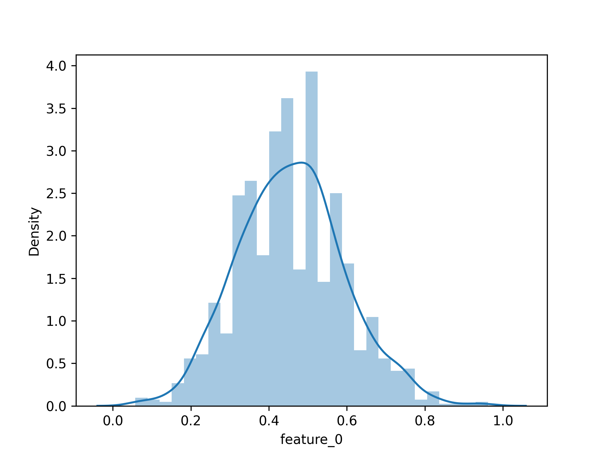
    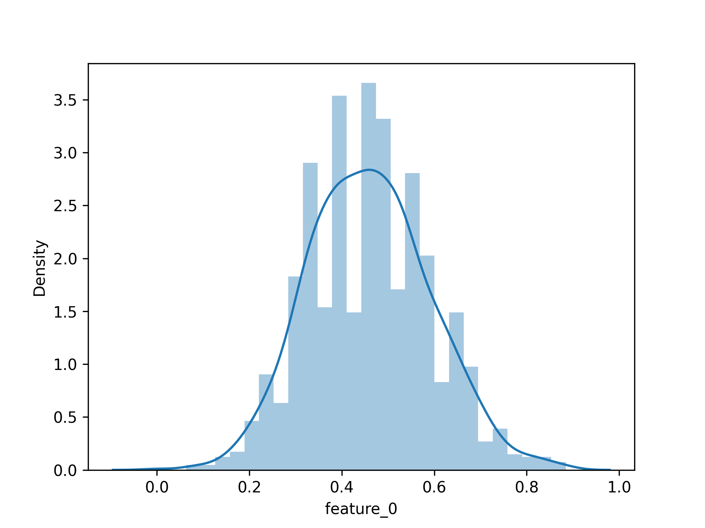
</center>

<center class="half">    
    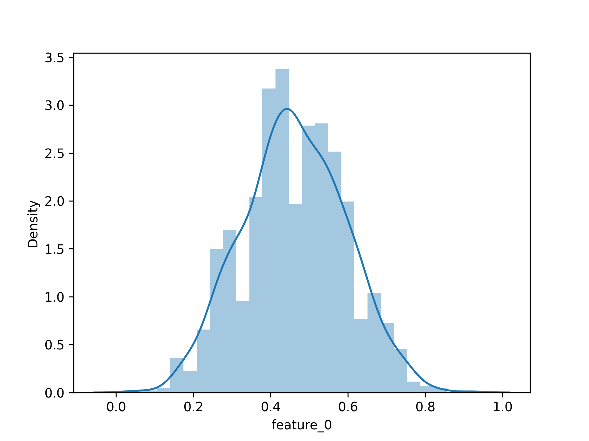
    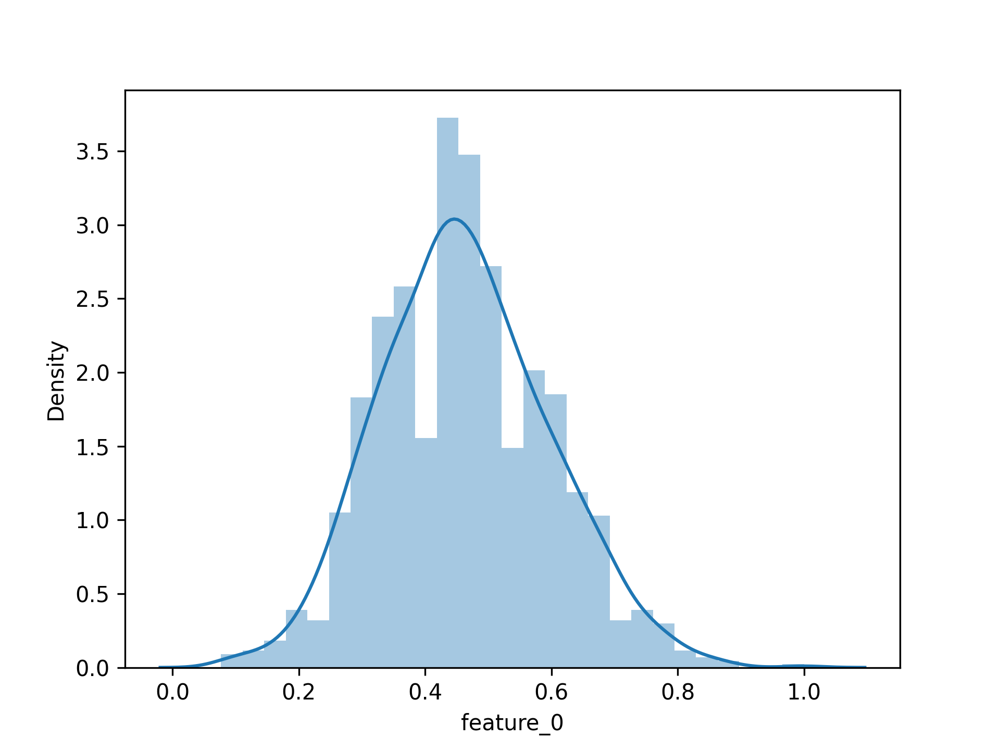 
</center>

可以看出，分布曲线基本相同。经过人工筛选，所有 120 个特征均符合该描述。因此可以推断：仅依靠单独特征无法有效对样本进行分类。我们需要借助特征之间的关系进行特征的选择。

​		根据助教对于本次实验的描述，冗余特征并不一定是均匀分布的。但是我们依然尝试删除了 120 个特征中所有符合均匀分布的特征。进过测试，这样的操作使得部分模型的准确率提高了 10%。（尽管没有什么道理）

<center class="half">    
    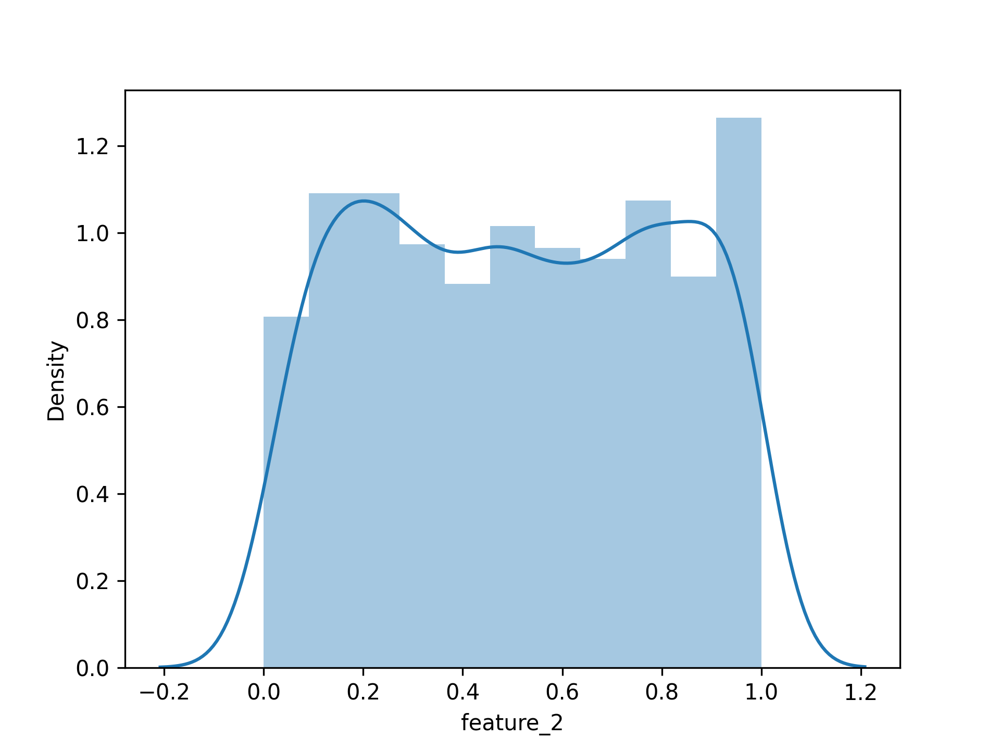
    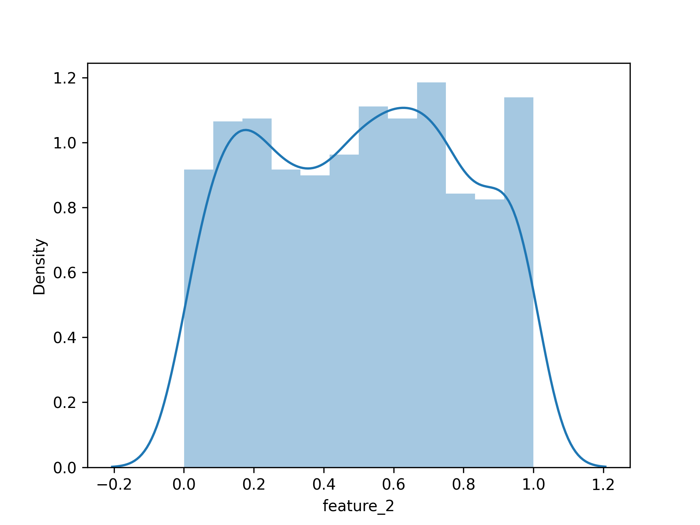
</center>

<center class="half">    
    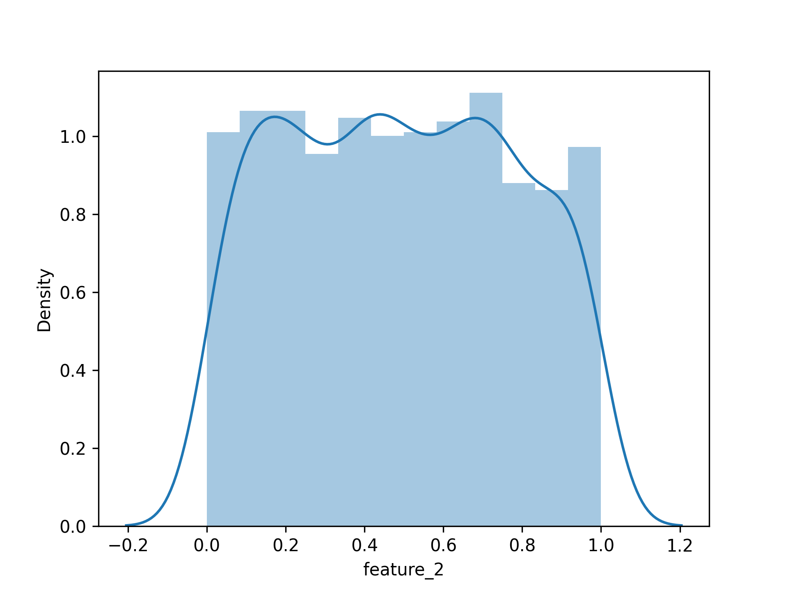
    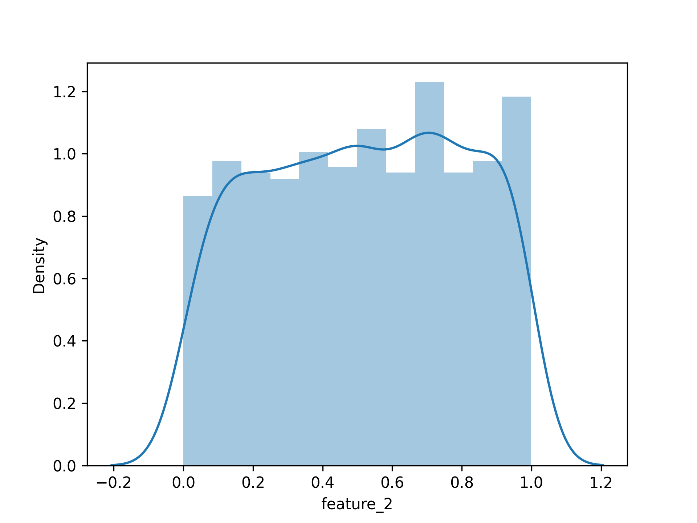 
</center>

​		在说到特征选择时，主成分分析法是必不可少的。PCA 从原始的空间中顺序地找一组相互正交的坐标轴，新的坐标轴的选择与数据本身是密切相关的。这相当于只保留包含绝大部分方差的维度特征，而忽略包含方差几乎为 0 的特征维度，实现对数据特征的降维处理。然而自主编写的 PCA 程序对原始数据降维后并没有在精度上产生显著提升。这从数据分布中可以看出，因为所有特征并没有出现集中分布的趋势，因而应用 PCA 无法得到较好的效果。

​		那么，我们应当如何得到有效的特征呢？可以采用如下的策略：使用决策树对全特征数据进行分类，并统计决策路径与权重。在多次重复实验后，得到各个特征的初始权重排序关系。从中选择排名靠前的特征，进行重复训练。直到最终的特征权重分布不再出现明显变化。当然，用于全特征计算的决策树应当具有稳定的弱分类能力。如下所示，采用的决策树分类准确率稳定在 0.26+，得到了一系列决策路径。

```
|--- feature_37 <= 152.50
|   |--- feature_15 <= 13.50
|   |   |--- feature_45 <= 6.77
|   |   |   |--- feature_9 <= 3.93
|   |   |   |   |--- feature_51 <= 0.30
|   |   |   |   |   |--- feature_55 <= 60.50
|   |   |   |   |   |   |--- feature_10 <= 3.50
|   |   |   |   |   |   |   |--- feature_5 <= 185.50
|   |   |   |   |   |   |   |   |--- class: 0
|   |   |   |   |   |   |   |--- feature_5 >  185.50
|   |   |   |   |   |   |   |   |--- class: 3
......

决策树分类准确度为 0.26250962278675904
```

​		最终，我们可以将 120 个特征减少到 12 个特征，且仅使用 12 个特征得到的训练结果相比原始全特征的训练结果提升了约 1~2%。可以认为，筛选出的 12 个特征为本次实验的主要特征，本次实验也将采用这 12 个特征进行后续处理。

```python
leave_f = [
    'feature_9', 'feature_35',
    'feature_43', 'feature_48',
    'feature_67', 'feature_92',
    'feature_98', 'feature_99',
    'feature_100', 'feature_101',
    'feature_106', 'feature_114',
]
```


### 归一化处理

​		在机器学习中领域中的数据分析之前，通常需要将数据标准化，利用标准化后得数据进行数据分析。不同评价指标往往具有不同的量纲和量纲单位，这样的情况会影响到数据分析的结果，为了消除指标之间的量纲影响，需要进行数据标准化处理，以解决数据指标之间的可比性。原始数据经过数据标准化处理后，各指标处于同一数量级，适合进行综合对比评价。这就是数据归一化的目的。

​		本次实验选择**最大-最小标准化**方式进行数据归一化。

```python
def Normalization(df: pd.DataFrame, if_debug = False) -> pd.DataFrame:    
    _df = df.copy()
    _df_ft = _df.iloc[:, :-1]
    _df_lb = _df.iloc[:, -1:]
    
    _df_ft = _df_ft.apply(lambda x: (x - np.min(x)) / (np.max(x) - np.min(x))).round(8)
    _df = pd.concat([_df_ft, _df_lb], axis=1)
    
    if if_debug == True:
        _df.to_csv("./debug/normalization.csv", index=False) 
    
    return _df
```


## 数据划分

​		考虑到本次实验为四分类任务，我们在先前随机分割函数的基础上增加了标签筛选功能，对于每个类别的样本分别按比例划分成训练集与测试集，从而保证了最终结果的类别分布与原数据集类别分布相同。

```python
def random_Split_Data_Label(data: pd.DataFrame, labels = [0, 1, 2, 3], rate = 0.75, random_seed: int = -1, if_debug = False):    
    _, n = data.shape
        
    X_train = np.empty(shape=[0, n-1])
    y_train = np.empty(shape=[0, 1])
    X_test = np.empty(shape=[0, n-1])
    y_test = np.empty(shape=[0, 1])
    
    for label in labels:
        sub_data = data.query('label==' + str(label))
        sub_X_train, sub_y_train, sub_X_test, sub_y_test = 
        	random_Split_data(sub_data, rate, random_seed, if_debug)
            
        X_train = np.vstack((X_train, sub_X_train))
        y_train = np.vstack((y_train, sub_y_train))
        X_test = np.vstack((X_test, sub_X_test))
        y_test = np.vstack((y_test, sub_y_test))
        
    train = np.hstack((X_train, y_train))
    test = np.hstack((X_test, y_test))
   
    np.random.shuffle(train)
    np.random.shuffle(test)
    
    X_train = train[:, :-1]
    y_train = train[:, -1:]
    X_test = test[:, :-1]
    y_test = test[:, -1:]
    return X_train, y_train, X_test, y_test
```

​		默认的 label 为 0, 1, 2, 3，也就是四个类别都会有样本被划分。若是指定 label 为 0,1，则只有类别为 0，1 的样本会被划分为训练集与测试集。这样设计的目的是为了兼容二分类模型（例如 SVM），并且可以据此构建投票法下的多分类模型。


## 模型训练与评估

### 结果的评价

​		本次实验使用下列指标来验证模型的算法效果和不同参数对于结果的影响

- $E(f;D)=\frac{1}{m}\sum_{i=1}^m\mathbb{I}(f(x_i)\neq y_i)\\$，分类错误率，越小越好
- $Acc(f;D)=1-E(f;D)$，分类精度，越大越好

```python
def Err_label(y_pre: (list | np.ndarray), y_real: np.ndarray):   
    if isinstance(y_real, list):
        y_real = np.array(y_real).reshape(-1, 1)
    m, _ = y_real.shape
    score = 0
    
    for i in range(m):
        if y_pre[i] != y_real[i]:
            score += 1     
    return score * 1.0 / m


def Accuracy(y_pre: (list | np.ndarray), y_real: np.ndarray):
    return 1 - Err_label(y_pre, y_real)
```


### 模型的存储

​		为了保存可能效果良好的模型，我们引入了第三方库进行操作。以线性回归模型为例：

```python
import pickle
import time

def save(self, filename = None):
    if filename == None:
        t_str = time.strftime('%Y_%m_%d_%H_%M_%S', time.localtime())
        filename = "./model/Model_LinearReg" + "_" + t_str + ".dat"

    pickle.dump(self, open(filename, "wb"))
```

可以按照如下方式使用：

```python
import pickle as pk
......
model_liner.save()
model_liner = pk.load(open(FILENAME, "rb"))    # 使用已保存的模型
```


### 线性回归模型

```python
class LinearRegression:

    def __init__(self, X: np.ndarray, y: np.ndarray):
        self.X = X
        self.y = y
        self._X = np.linalg.inv(self.X.T @ self.X) @ self.X.T @ self.y
        

    def fit(self):
        pass
        
    def predict(self, X:np.ndarray) -> np.ndarray: 
        y_pre = X @ self._X
        y_pre = y_pre.reshape(-1, 1)
       
        return y_pre
```

​		线性回归模型是最为原始也是最为基础的模型，基础到没有参数可调......无论采用什么处理方法，结果正确率稳定在 0.25 附近，这表明原始数据不是线性分布的。

​		额外需要补充的一点是，线性回归模型得到的结果是连续化的，我们需要对其标签化。一个自然的处理方式如下：

```python
def Labelize(pre: np.ndarray) -> list:
    m, _ = pre.shape
    result = []
    
    for i in range(m):
        if pre[i][0] >= 2.5:
            result.append(3)
        elif pre[i][0] >= 1.5:
            result.append(2)
        elif pre[i][0] >= 0.5:
            result.append(1)
        else:
            result.append(0)
    
    return result
```


### 决策树模型

```python
class DecisionTree:
    
    def __init__(self, X, y):
        self.X = X
        self.y = y
        
        
    def _set_parameters(self, default_parameters: dict):
        self.if_silent = default_parameters['if_silent']
        self.tree = DecisionTreeClassifier(
            criterion=default_parameters['criterion'],
            splitter = default_parameters['splitter'],
            min_samples_split = default_parameters['min_samples_split'],
            max_depth = default_parameters['max_depth'],
            min_samples_leaf = default_parameters['min_samples_leaf'],
            max_leaf_nodes = default_parameters['max_leaf_nodes'],
            min_impurity_decrease = default_parameters['min_impurity_decrease']
        )
        
    
    def fit(self, parameters: dict = {}):
        default_parameters = {
            "criterion": "entropy",    # 选择特征的标准，分为 "gini" 和 "entropy"
            "splitter": "best",        # 特征划分标准，分为 "best" 和 "random"
            "max_depth": 7,
            "min_samples_split": 1,    # 叶子最小样本数
            "min_samples_leaf": 2,     # 划分最小样本数
            "max_leaf_nodes": 1000,    # 最大叶节点个数
            "min_impurity_decrease": 0.0, # 最小划分不纯度减少量
            "if_silent": 1
        }
        
        for key in parameters.keys():
            if default_parameters.__contains__(key):
                default_parameters[key] = parameters[key]
        self._set_parameters(default_parameters)
        
        self.tree.fit(self.X, self.y)
        
        if self.if_silent == 0:
            text_representation = tree.export_text(self.tree)
            print(text_representation)
        
        
    def predict(self, X):
        return self.tree.predict(X)  
```


#### 自动调参

​		针对决策树的深度与划分最小样本数两个参数进行网格式调参，得到的部分结果如下：

**注：准确率为 10 次训练的均值**

| 数据处理方法 | 深度 | 划分样本数 | 准确率  |
| :----------: | :--: | :--------: | :-----: |
|    方法 1    |  20  |     14     | 0.28747 |
|    方法 1    |  21  |     12     | 0.28570 |
|    方法 1    |  18  |     14     | 0.28285 |
|    方法 1    |  17  |     12     | 0.27909 |
|    方法 1    |  23  |     12     | 0.27394 |
|    方法 1    |  19  |     15     | 0.27086 |
|    方法 1    |  11  |     12     | 0.26825 |
|    方法 1    |  25  |     7      | 0.26556 |
|    方法 1    |  7   |     10     | 0.25903 |
|    方法 1    |  19  |     17     | 0.25595 |

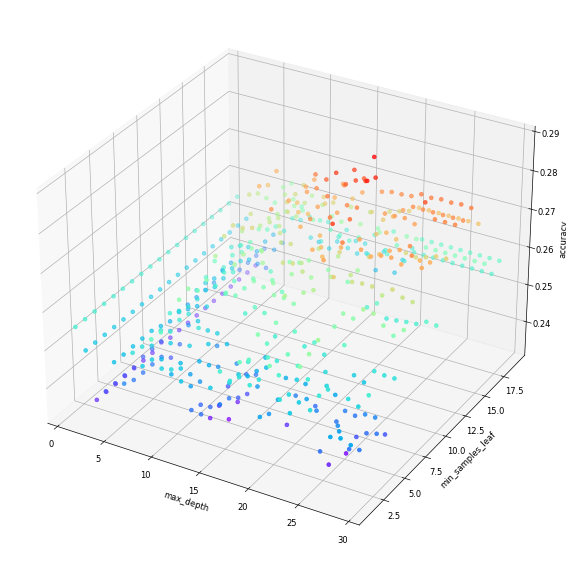

| 数据处理方法 | 深度 | 划分样本数 | 准确率  |
| :----------: | :--: | :--------: | :-----: |
|    方法 2    |  13  |     20     | 0.29519 |
|    方法 2    |  10  |     26     | 0.28672 |
|    方法 2    |  6   |     26     | 0.27966 |
|    方法 2    |  7   |     31     | 0.27542 |
|    方法 2    |  7   |     12     | 0.27118 |
|    方法 2    |  1   |     1      | 0.26836 |
|    方法 2    |  11  |     13     | 0.26553 |
|    方法 2    |  5   |     37     | 0.25988 |
|    方法 2    |  4   |     13     | 0.25141 |
|    方法 2    |  15  |     6      | 0.25000 |

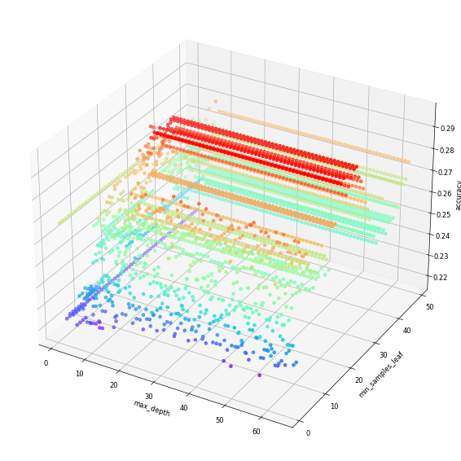

| 数据处理方法 | 深度 | 划分样本数 | 准确率  |
| :----------: | :--: | :--------: | :-----: |
|    方法 3    |  12  |     5      | 0.26824 |
|    方法 3    |  12  |     4      | 0.26491 |
|    方法 3    |  7   |     41     | 0.25924 |
|    方法 3    |  8   |     21     | 0.25791 |
|    方法 3    |  10  |     4      | 0.25558 |
|    方法 3    |  5   |     7      | 0.25358 |
|    方法 3    |  5   |     9      | 0.25124 |

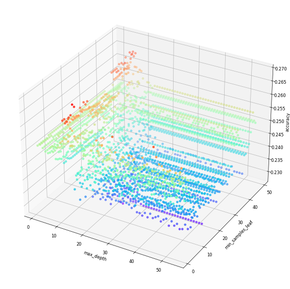

#### 总结

​		可以发现，将异常数据进行修正反而降低了模型的准确率。这很大程度上与我们选择的修正策略有关。我们无法还原出原始数据的真实分布情况，而仅仅用均值进行简单的替换在一定程度上引入了额外的误差。比较理想的方案是，在一个合适的区间内对于异常值进行随机替换，或者根据该样本其他正常数据的分布情况决定合适的替换策略。然而由于工作量过大，本实验中没有进行更为深入的探讨。

​		决策树模型的结果是较为出乎意料的。理论上来说，决策树深度越深，出现过拟合的可能性越高，但本实验中的最优分类器均出现在深度 > 10 的情况之中。目前我们也没有一个对此较为合理的解释。


### 支持向量机模型

```python
# 支持向量机
import numpy as np
def my_max(a, b):
    return a if a > b else b

def find_zero(a, b):
    return 0 if a == 0 else b

def array_max(a:np.ndarray, b:np.ndarray)->np.ndarray:
    func_ = np.frompyfunc(my_max, 2, 1)
    return(func_(a, b))

def array_find0(a:np.ndarray, b:np.ndarray) -> np.ndarray:
    func_ = np.frompyfunc(find_zero, 2, 1)
    return(func_(a, b))

# The above function implements the corresponding operation of each dimension of the vector.

class SupportVectorMachine:

    def __init__(self, X:np.ndarray, y:np.ndarray):
        self.X = X
        self.y = y
        self.m, self.n = self.X.shape 
        self.w = np.zeros((self.n + 1, 1))
        
        
        unique, count=np.unique(self.y, return_counts=True)
        data_count = dict(zip(unique, count))
        
        keys = []
        for key in data_count:
            keys.append(key)
                
        self.neg = keys[0]
        self.pos = keys[1]
        self.y[self.y == self.neg] = -1
        self.y[self.y == self.pos] = 1


    def fit(self, gamma=0.25, lr=0.002, tol=1e-4, max_times=500, ifsilent=True):
        # Preprocess the training data
        temp_1 = np.ones((self.m, 1))
        X_hat:np.ndarray = np.c_[self.X, temp_1]

        temp_0 = np.zeros((self.m, 1))
        loss_list = []
        y_diag = np.diag(self.y.reshape(-1))
        
        info_gap = max_times / 20
        
        # Start iterating
        if ifsilent:
            for times in range(max_times):
                xi = array_max(temp_0, 1 - (y_diag @ X_hat @ self.w))
                loss = 0.5 * (self.w.T @ self.w)[0][0] + gamma * (xi.sum())
            
                y_bar = array_find0(xi , self.y)
                delta_1 = self.w - gamma * (X_hat.T @ y_bar)
                
                if times >= 2 and abs(loss_list[-1] - loss) < tol:
                    loss_list.append(loss)
                    break

                self.w = self.w - lr * delta_1
                loss_list.append(loss)
        else:
            for times in range(max_times):
                xi = array_max(temp_0, 1 - (y_diag @ X_hat @ self.w))
                loss = 0.5 * (self.w.T @ self.w)[0][0] + gamma * (xi.sum())
                
                y_bar = array_find0(xi , self.y)
                delta_1 = self.w - gamma * (X_hat.T @ y_bar)
                
                if times >= 2 and abs(loss_list[-1] - loss) < tol:
                    loss_list.append(loss)
                    break

                if (times % info_gap == 0):
                    print("Current times: {}, loss is {}".format(times, loss))

                self.w = self.w - lr * delta_1
                loss_list.append(loss)

        return loss_list, times
            

        
    def predict(self, X:np.ndarray) -> np.ndarray:
        m, n = X.shape
        temp_1 = np.ones(m)
        X_hat:np.ndarray = np.c_[X, temp_1]
        temp = X_hat @ self.w
        ans = []
        for i in range(m):
            if temp[i] > 0:
                ans.append(self.pos)
            else:
                ans.append(self.neg)
        return np.array(ans).reshape(-1, 1)
```

​		Lab2 中实现了两种不同方法的 SVM：基于梯度下降与基于 SMO。当时的实验结果表明 SMO 法在大样本计算上时间开销巨大，因此本次实验我们选择梯度下降法作为 SVM 的设计策略。


#### 投票法		

​		Lab2 中实现的 SVM 仅支持二分类任务。为了使其支持本次实验的四分类内容，我们进行了一点改进，输入的原始标签将被更改为 -1、1，并在最终的预测阶段进行还原。这样我们就需要训练 $\text{C}_4^2=6$ 个 SVM 模型，根据其结果投票得到四分类的最终结果。

```python
pre_01 = model_SVM_01.predict(X_test)
pre_02 = model_SVM_02.predict(X_test)
pre_03 = model_SVM_03.predict(X_test)
pre_12 = model_SVM_12.predict(X_test)
pre_13 = model_SVM_13.predict(X_test)
pre_23 = model_SVM_23.predict(X_test)

m, _ = X_test.shape
pre_svm = np.zeros((m, 1))

for i in range(0, m):
    vote = [0, 0, 0, 0]
    vote[int(pre_01[i, 0])] += 1
    vote[int(pre_02[i, 0])] += 1
    vote[int(pre_03[i, 0])] += 1
    vote[int(pre_12[i, 0])] += 1
    vote[int(pre_13[i, 0])] += 1
    vote[int(pre_23[i, 0])] += 1
    pre_svm[i, 0] = vote.index(max(vote))
```

一次 SVM 的训练过程如下所示（从左至右依次为方法一、方法二、方法三）：

<center class="half">    
    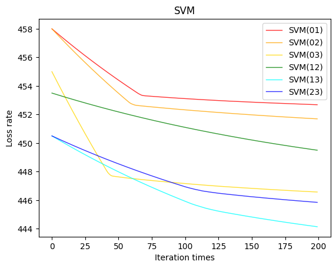
    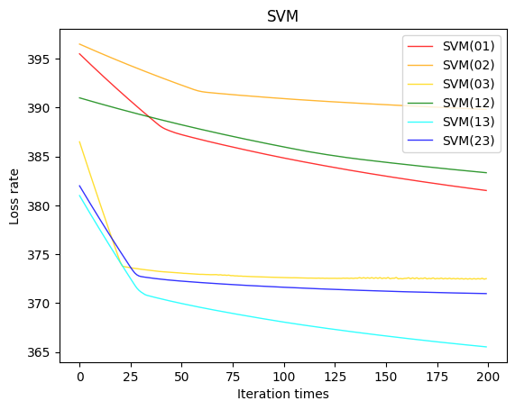
    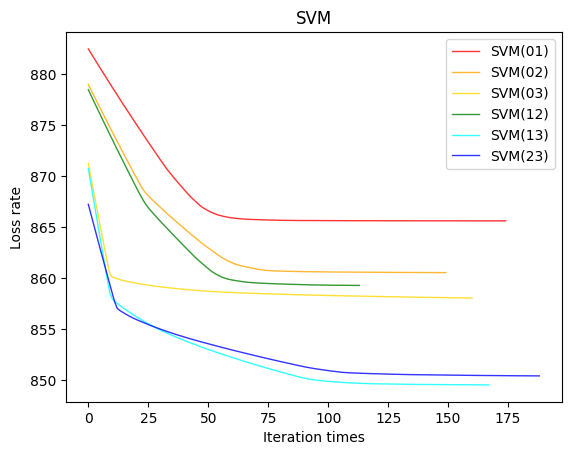
</center>

|    模型    | SVM (01) | SVM (02) | SVM (03) | SVM (12) | SVM (13) | SVM (23) | Final SVM |
| :--------: | :------: | :------: | :------: | :------: | :------: | :------: | :-------: |
|   方法1    | 0.50444  | 0.50444  | 0.50832  | 0.50000  | 0.50832  | 0.50832  |  0.25432  |
|   方法2    | 0.52500  | 0.50660  | 0.51879  | 0.51713  | 0.50534  | 0.51219  |  0.26497  |
|   方法3    | 0.49339  | 0.51227  | 0.50669  | 0.52023  | 0.49933  | 0.51109  |  0.26124  |
| 方法2(skl) | 0.51911  | 0.50660  | 0.52180  | 0.53055  | 0.49618  | 0.51676  |  0.25973  |

​		可以看到，各个子 SVM 分类器的准确率均略优于随机分类器，最终得到的 SVM 模型效果也优于随机分类器。然而普通的 SVM 依然是基于线性分类而工作的，因此在本数据集上工作不够理想。可以通过引入核方法对此进行改进。由于时间限制，本实验中不在深入讨论。


### 神经网络模型

```python
# 神经网络
class NeuralNetwork:
    
    def __init__(self, X, y):
        self.model = MLPClassifier(solver='lbfgs', alpha=1e-5, hidden_layer_sizes=(15, ), random_state=1)
        self.X = X
        self.y = y
    
    
    def _set_parameters(self, default_parameters: dict):
        
        self.model = MLPClassifier(
            hidden_layer_sizes = default_parameters["hidden_layer_sizes"],
            activation = default_parameters["activation"],
            alpha = default_parameters["alpha"],
            max_iter = default_parameters["max_iter"],
            tol = default_parameters["tol"],
            verbose = default_parameters["if_silent"] == False,
            early_stopping = default_parameters["early_stopping"],
            validation_fraction = default_parameters["validation_fraction"],
        )
    
    
    def fit(self, parameters: dict = {}):
        default_parameters = {
            "hidden_layer_sizes": (100, ),
            "activation": 'relu',
            "alpha": 0.0001,
            "max_iter": 200, 
            "tol": 1e-4, 
            "if_silent": True, 
            "early_stopping": False,
            "validation_fraction": 0.1,
        }
        for key in parameters.keys():
            if default_parameters.__contains__(key):
                default_parameters[key] = parameters[key]
        self._set_parameters(default_parameters)
        
        
        self.model.fit(self.X, self.y)
        
        
    def predict(self, X):
        return self.model.predict(X)
```


### XGBoost 模型

```python
# XGBoost
class XGBoost(object):
    def __init__(self, X, y) -> None:
        self.X = X
        self.y = y
        
        
    def _set_parameters(self, default_parameters: dict):
        self.if_silent = default_parameters['if_silent']
        
        self.model = XGBC(
            learning_rate = default_parameters['learning_rate'],
            min_child_weight = default_parameters['min_child_weight'],
            max_depth = default_parameters['max_depth'],
            gamma = default_parameters['gamma'],
            subsample = default_parameters['subsample'],
            max_delta_step = default_parameters['max_delta_step'],
            colsample_bytree = default_parameters['colsample_bytree'],
            reg_lambda = default_parameters['reg_lambda'],
            reg_alpha = default_parameters['reg_alpha'],
            objective = default_parameters['objective'],
            num_class = default_parameters['num_class'],
            n_estimators = default_parameters['n_estimators'],
            seed = default_parameters['seed'],          
        )
    
    def fit(self, parameters:dict = {}):
        
        default_parameters = {
            "learning_rate": 0.3,       # 如同学习率
            "min_child_weight": 1, 
            "max_depth": 8,             # 构建树的深度，越大越容易过拟合
            "gamma": 0,                 # 树的叶子节点上作进一步分区所需的最小损失减少,越大越保守，一般0.1、0.2这样子。
            "subsample": 1,             # 随机采样训练样本 训练实例的子采样比
            "max_delta_step": 0,        # 最大增量步长，我们允许每个树的权重估计。
            "colsample_bytree": 1,      # 生成树时进行的列采样 
            "reg_lambda": 1,            # 控制模型复杂度的权重值的L2正则化项参数，参数越大，模型越不容易过拟合。
            "reg_alpha": 0,             # L1 正则项参数       
            "objective": 'multi:softmax',   # 多分类的问题 指定学习任务和相应的学习目标 binary：logitraw
            "num_class": 4,             # 类别数
            "n_estimators": 50,         # 树的个数
            "seed": 1000,                # 随机种子     
            "if_silent": 1,
        }
        for key in parameters.keys():
            if default_parameters.__contains__(key):
                default_parameters[key] = parameters[key]
        self._set_parameters(default_parameters)
        
        self.model.fit(self.X, self.y)
        
    
    def predict(self, X):
        return self.model.predict(X)
    
```


## 实验总结

​		事实上，经过长达 20 多天的测试与分析，本次实验的准确率依然维持在一个较低的水平。如果从结果上来看，这个实验无疑是很难令人满意的。但回顾这段时间以来的试错过程，或许这是目前为止最为成功的一次实验。Lab1~Lab4 的数据集都是表现良好、易于处理的，且最终的结果十分清晰。但这只是偶然，并不是现实世界的普遍情况。Lab5 的数据集以及表现平平的结果或许才是常态。

​		但是，在本次实验中，我切实地体会到了数据处理阶段的重要作用。先前的实验聚焦于模型本身，而这一次则放眼完整的过程。模型仅仅是一个工具，一个实验结果的好坏取决于模型的选择，但更取决于对于数据的理解与把控。并不存在一种通用的、万金油的机器学习模型或方法，我们所能依靠的只有具体问题具体分析。